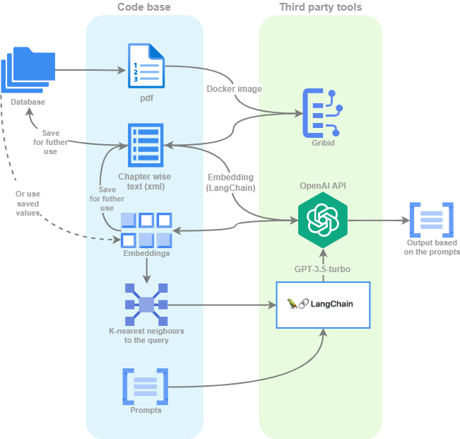

# FullTextTagging
The goal is to assist screeners with inclusion/exclusion decisions, when screening academic papers for systematic literature review.
This project aims to annotate the data with suitable 'tags', that can further be used to assist the inclusion/exclusion decision.
The approach taken here aims to implement a naive Retrieval Augumented Generation (RAG) model to obtain costefficiency regardless of the fairly large context size of scientific papers. 


The intuition behind this model is that given a pdf of a research paper, 
1. we divide the main text to chapters
2. embed those chapters
3. Find the relevant chapters with similarity search using FAISS (https://github.com/facebookresearch/faiss)
4. give those chapters as a context to LLM together with prompt engineered to prevent hallucinations
5. Get the output tag from the LLM

This is also visualized in the Figure below more in detail.


## Environement
The **CPU** conda environment can be created with command
`conda env create -f cpu-env.yml`
then activate with
`conda activate pytorch-env-cpu`
and if needed the environment can be updated (the environment has to bee active) based on the changed yml file as
`conda env update --file cpu-env.yml --prune`

**OBS!** In addition for visualizations Poppler needs to be downloaded from https://github.com/oschwartz10612/poppler-windows/releases/ and the path for it's location needs to be provided in the `constants.py` file as `poppler_path`, eg  `poppler_path = r"..\Release-23.11.0-0\poppler-23.11.0\Library\bin" `

### API keys

If using ChatGPT based models save your personal API key to file named `constants.py`
e.g.
`OPENAI_API_KEY = "your personal API key" `

OBS! ChatGPT API charges by use, so it is useful to set limits for maximum charging

## Data
The data can be given as pdf's (less accurate) or as xml files generated with grobid.

1. To generate the xml files first install the Grobid Docker image as https://grobid.readthedocs.io/en/latest/Grobid-docker/.
2. Run the image with `docker run --rm --init --ulimit core=0 -p 8070:8070 lfoppiano/grobid:0.8.0`
3. Pull the Grobid python API from github (https://github.com/kermitt2/grobid_client_python)
4. Install the python API and run the next command from the robid_client_python folder
5. Generate the tei.xml output with the Grobid Python API as `grobid_client --input ../input_pdf_folder --output ../tmp/output_xml_folder --teiCoordinates processFulltextDocument`
6. Use the python script to precess the grobit files as `python3 process_grobit_files.py --input_folder path/to/inputfolder --output_folder path/to/outputfolder`

Another option is to provide just the pdf file. see ```pre_precessing.py```
- PDFminer.six is used to extract the text from the pdf (assuming it's not an image pdf)
- Format information is used to exclude titles, headers and references
- However this is less accurate approach compared to the grobit, and will cause unnessesary mistakes.

## Running the validation model

**OBS** Only the validation model is implemented, and it is only implemented for animal/human/in vitro clssification due to the missing data. Inference needs to be developed as well as further prompt engineering to address all questions within the decision tree.
i.e. the curren run file assumes that you always have the file that includes the ground truth.

Also the test mode only outputs printed output, thus it also needs to be further developed once we have the data and we know the desired output format.

To select the input data type use keyword:

- `--input_type pdf` or `--input_type xml`, xml corresponding to the processed grobit output.

other keyword in the run command are:
-  `--infile` to define the path to the csv file that contains the output file from SyRF, it also has to have the column relative_path that corresponds to the names of the pdf files or to the names of the xml file, see for example `data/test_SD_files/Annotation_data.csv`
- `--mode` either `test` or `run`, however run mode is not implemented yet, thus only test is possible (assumes that we have the ground truth)
- `--max_test_n` the size of the test set.

**Running the model**
Thus the model can be run for example as follows: 
1. Navigate to the folder `code`
2. Run the following command within the conda env

 `python run.py --input_type pdf --infile ../data/test_SD_files/Annotation_data.csv --mode test --max_test_n 50`

 `python run.py --input_type xml --infile ../data/test_SD_files/Annotation_data.csv --data_path ../data/processed_xml_files --mode test --max_test_n 50`


## Architecture of the code base


**Text extraction** - see ```pre_precessing.py```
- PDFminer.six is used to extract the text from the pdf (assuming it's not an image pdf)
- Format information is used to exclude titles, headers and references

**Grobit output processing** - see ```process_grobit_files.py```
- processes the files to the desired format and saves them to new xml files

**Text embedding** - see  ```custom_types.py```
- Use OpenAI to get text embedding for each chapter, if using xml file type, the embeddings will be saved for further use to decrease the cost of using OpenAI API


----

## Classes

**Paper Class** - see  ```custom_types.py```

**Text Class** - see  ```help_types.py```

**Answser Class** - see  ```help_types.py```

The code base adapts from code from https://github.com/whitead/paper-qa
